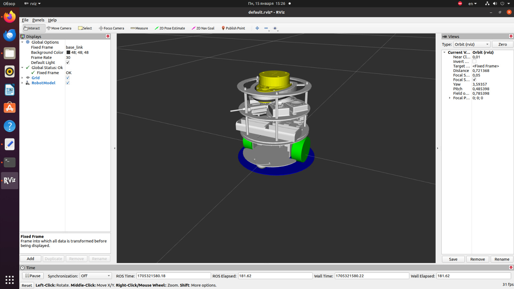

# Autonomous LiDAR-Based Mobile Robot
An autonomous mobile robot prototype designed to explore systematic coverage
navigation as an alternative to random movement patterns commonly used by
robotic lawn mowers.
**Independent engineering project · 2024–2025**

<p align="center">
  
</p>

<p align="center">
  <i>Completed physical prototype with a custom 3D-printed enclosure and 2D LiDAR.</i>
</p>

---
## Overview
Many robotic lawn mowers rely on boundary infrastructure and navigation
strategies that can produce irregular trajectories and repeated passes over
the same area.
The goal of this project was to build and experimentally test a mobile robot
capable of:
- mapping its environment using 2D LiDAR;
- navigating without external boundary infrastructure;
- using wheel odometry together with LiDAR data;
- following a systematic coverage strategy based on parallel passes;
- responding to obstacles detected during navigation.
The project resulted in a functioning physical prototype, a ROS-based
navigation system, and a virtual model of the robot.
---
## Project Idea
The original motivation was simple: instead of allowing a lawn mower to move
through an area in a largely irregular pattern, could it first understand its
environment and then cover it systematically?
The intended coverage pattern resembles the parallel passes used when mowing
sports fields:
```text
┌───────────────────────────────┐
│ → → → → → → → → → → → → → │
│                           ↓   │
│ ← ← ← ← ← ← ← ← ← ← ← ← ← │
│ ↓                             │
│ → → → → → → → → → → → → → │
│                           ↓   │
│ ← ← ← ← ← ← ← ← ← ← ← ← ← │
└───────────────────────────────┘
```

This approach was intended to reduce unnecessary repeated motion while also
producing a more regular coverage pattern.

---

## System Architecture

The prototype combines a Raspberry Pi, wheel encoders and a 2D LiDAR with a
ROS-based software stack.

              RPLIDAR A1
                   │
                   ▼
        Environment perception
                   │
                   ▼
          Mapping / localization
                   │
                   ▼
             Navigation
            ┌──────┴──────┐
            ▼             ▼
      Global route   Local obstacle
        planning       response
            └──────┬──────┘
                   ▼
             Motion control
                   │
                   ▼
       Differential-drive robot
                   ▲
                   │
             Wheel encoders

ROS was used to integrate sensing, robot description, motion control,
mapping and navigation.

---

## Hardware

* Raspberry Pi 4 Model B, 4 GB
* RPLIDAR A1 2D LiDAR
* Differential-drive mobile platform
* DC geared motors
* Quadrature magnetic wheel encoders
* Motor driver and onboard power system
* Custom-designed and 3D-printed enclosure and mechanical components

The wheel encoders provide odometry information, while the LiDAR supplies
360° range measurements of the surrounding environment.

Custom parts were designed and 3D printed to mount the onboard electronics
and LiDAR on the physical prototype.

---

## Software

The software stack was built around ROS Noetic running on Linux.

Technologies used:

* ROS Noetic
* C++
* Linux / Ubuntu
* Raspberry Pi
* RPLIDAR ROS integration
* URDF / Xacro robot description
* RViz visualization
* wheel-encoder odometry

<p align="center">
  
</p>

<p align="center">
  <i>Virtual robot model visualized in RViz.</i>
</p>

The project included ROS packages for the robot hardware interface, control,
description and teleoperation. Encoder integration was implemented through
drivers connected to the ROS-based control system.

---

## Mapping and Navigation

The robot was designed to first obtain information about the operating area
using LiDAR and build a map of its surroundings.

The resulting map could then be used by the navigation system to plan robot
motion through the environment.

<table>
  <tr>
    <td width="50%">
      
    </td>
    <td width="50%">
      
    </td>
  </tr>
  <tr>
    <td align="center"><i>Environment map generated during robot testing.</i></td>
    <td align="center"><i>Real-time LiDAR measurements visualized in RViz.</i></td>
  </tr>
</table>

Two navigation levels were involved:

Global planning — determining the intended route through the mapped area.

Local navigation — reacting to obstacles detected while the robot was
moving.

The coverage concept used systematic parallel passes rather than relying on
purely random motion.

Some parts of the navigation stack used existing ROS libraries and
packages. The original source code is being reviewed before making more
specific claims about which planning components were implemented or
modified directly in this project.

---

## Results

A functioning physical prototype was built and tested.

The system demonstrated:

* LiDAR-based environment mapping;
* wheel-encoder integration;
* autonomous navigation using the generated map;
* navigation without an external boundary wire;
* systematic coverage motion;
* obstacle-aware navigation;
* visualization and a virtual representation of the robot in ROS.

The project served as an experimental platform for exploring how mapping and
structured path planning can improve the movement of autonomous field robots.

---

## Demonstration Videos

Full project footage includes:

* physical prototype tests;
* LiDAR mapping;
* map visualization;
* route planning;
* ROS visualization and virtual robot model;
* autonomous navigation experiments.

⁠View full project footage on [Google Drive](https://drive.google.com/drive/folders/19ATJsEZQOZxSfQprEnhAnItSpBVlItQw?usp=sharing).

A shorter technical demonstration will be added later.

---

## Project Documentation

Detailed technical documentation and selected diagrams will be added to the
docs/ directory.

The documentation will cover:

* mechanical and electronic architecture;
* sensor selection and integration;
* ROS architecture;
* mapping and navigation;
* experimental results;
* limitations and possible improvements.

---

## Current Status

This repository documents a completed prototype developed in 2024–2025.

Some original project materials and source code are currently being recovered
and organized. The repository will therefore be expanded as the original
technical material is reviewed.

---

## Author

Independent engineering project developed before university as an exploration
of autonomous robotics, mapping and navigation.
